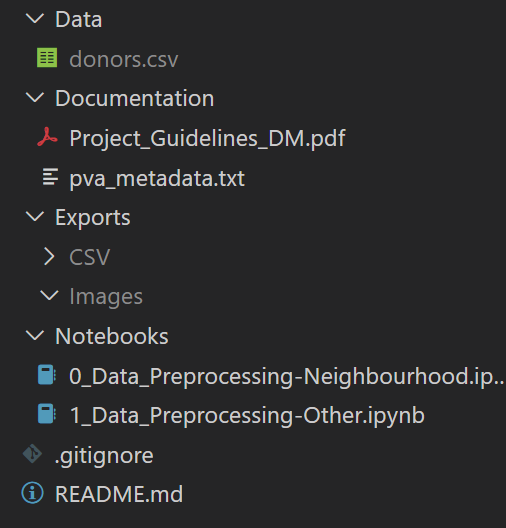

# DM
Data mining project - 2020/2021
 

**NOTE**
CSV exports from the notebooks were ignored, since they are larger than GitHub size limit.
To run the files, please create a directory like the following:
 

 
 

Notebooks Explanation:
- **Notebooks\0_Data_Preprocessing-Neighbourhood.ipynb**
File where neighborhood features are engineered and reduced, exporting a CSV file with the resulting PCA's
- **Notebooks\1_Data_Preprocessing-Other.ipynb**
File where features other than neighborhood are engineered, reduced and serve as base for new features, exporting a CSV file with the resulting features
- **Notebooks\2_Clustering.ipynb**
File where features are merged and the clustering is performed and further analysed.